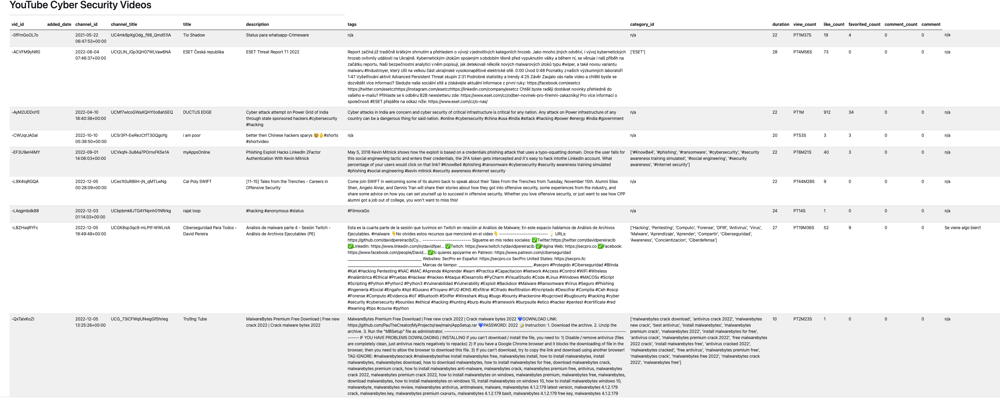

# YouTube Cyber Security Videos

## youtube-webapp

This is the directory for the files used for the Flask app located [here](https://youtube-b3foqn367a-uw.a.run.app/). It connects to the postgresql database in GCP and then renders the respective table using bootstrap. There are other files not used that were based on templates experimented upon, along with GCP Flask app sample deployment files.

## code

The directory for all code

### code/randygrant_final.ipynb

This is the code written to interact with the YouTube API to get data about videos such as title, comments, etc. The code then takes the results and exports them to a csv file.

### code/database-operations.ipynb

This updates the GCP database with the results in the csv created from the results.

### code/youtube-data.csv

Results from YouTube to put into a database.

## written_descriptions

This is the directory for the summary of work.

## presentation_slides

This is the directory for the presentation.

## Final Product

Here's what the site looks like:

