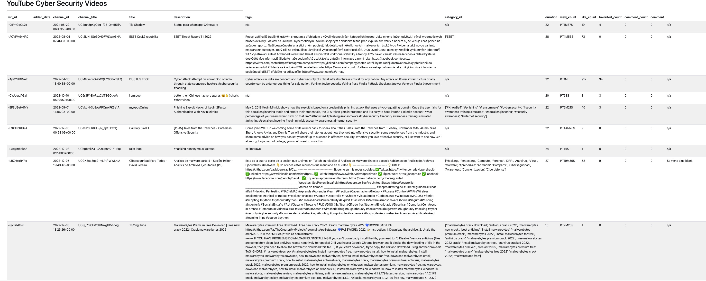

# YouTube Cyber Security Videos

These are the files used for the Flask app located [here](https://youtube-b3foqn367a-uw.a.run.app/). It connects to the postgresql database in GCP and then renders the respective table using bootstrap. There are other files not used that were based on templates experimented upon, along with GCP Flask app sample deployment files.

Here's what the site looks like:

